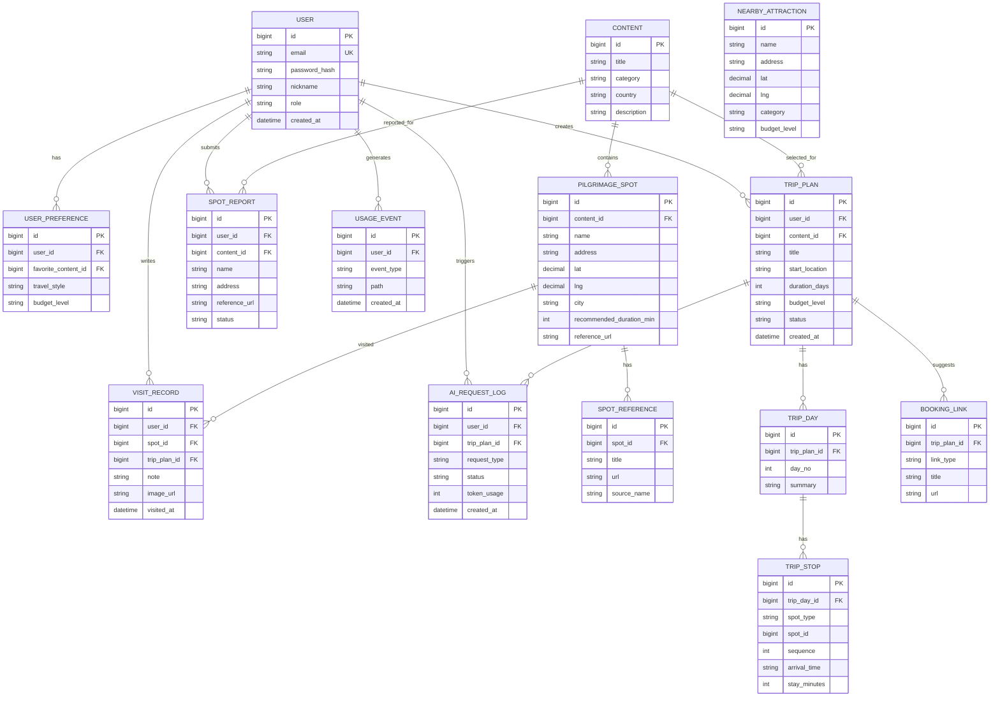
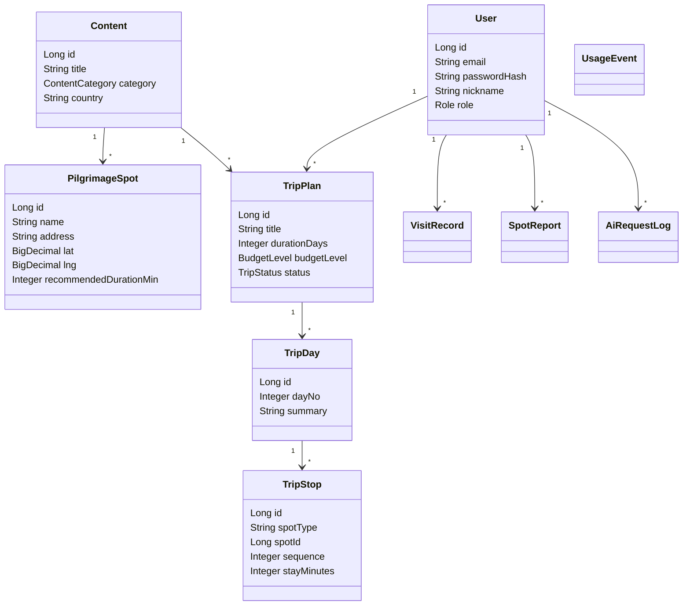

# 04. 도메인 모델 & ERD

> 제출물: ERD, Class Diagram. Mermaid로 관리하고 PNG는 `../발표자료/assets`로 export한다.

## 엔티티 목록

| 엔티티 | 설명 | 주요 필드 |
|--------|------|-----------|
| User | 회원 | id, email, password_hash, nickname, role, created_at |
| UserPreference | 사용자 선호 정보 | id, user_id, favorite_content_id, travel_style, budget_level |
| Content | 작품/콘텐츠 | id, title, category, country, description |
| PilgrimageSpot | 성지 스팟 | id, content_id, name, address, lat, lng, city, recommended_duration_min, reference_url |
| NearbyAttraction | 주변 일반 관광지 | id, name, address, lat, lng, category, budget_level |
| SpotReference | 성지 레퍼런스 링크 | id, spot_id, title, url, source_name |
| TripPlan | 여행 일정 | id, user_id, title, content_id, start_location, duration_days, budget_level, status |
| TripDay | 일자별 일정 | id, trip_plan_id, day_no, summary |
| TripStop | 일정 내 방문 장소 | id, trip_day_id, spot_type, spot_id, sequence, arrival_time, stay_minutes |
| VisitRecord | 방문 인증/메모 | id, user_id, spot_id, trip_plan_id, note, image_url, visited_at |
| SpotReport | 사용자 성지 제보 | id, user_id, content_id, name, address, reference_url, status |
| AiRequestLog | AI 호출 로그 | id, user_id, trip_plan_id, request_type, status, token_usage, created_at |
| UsageEvent | 접속/이용 이벤트 | id, user_id, event_type, path, created_at |
| BookingLink | 항공권/숙소 외부 링크 | id, trip_plan_id, link_type, title, url |

## ERD (Mermaid)

## Class Diagram

## 설계 메모

- `TripStop.spot_type`은 MVP에서 `PILGRIMAGE` 또는 `ATTRACTION`으로 구분한다.
- `TripStop.spot_id`는 타입에 따라 `PilgrimageSpot` 또는 `NearbyAttraction`을 참조한다. 구현 시 다형 관계가 부담되면 `pilgrimage_spot_id`, `nearby_attraction_id`로 분리한다.
- MVP에서는 실제 지도 API 없이 위도/경도 mock 데이터로 지도 UI를 구성한다.
