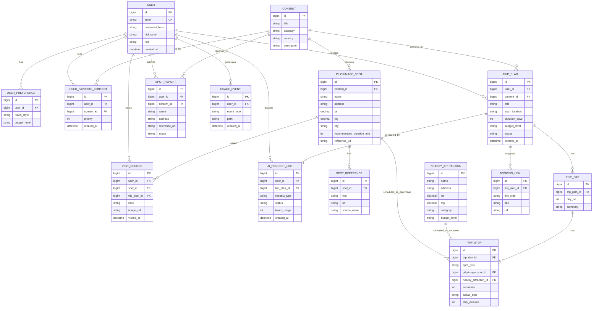
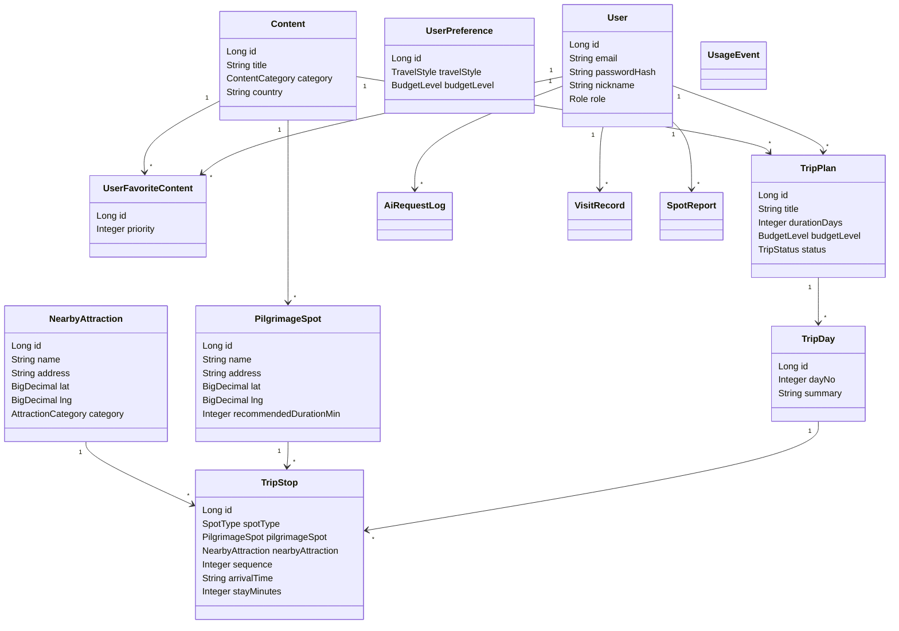

# 04. 도메인 모델 & ERD

> 제출물: ERD, Class Diagram. Mermaid로 관리하고 PNG는 `../발표자료/assets`로 export한다.

## 엔티티 목록

| 엔티티 | 설명 | 주요 필드 |
|--------|------|-----------|
| User | 회원 | id, email, password_hash, nickname, role, created_at |
| UserPreference | 사용자 여행 선호 정보 | id, user_id, travel_style, budget_level |
| UserFavoriteContent | 사용자 선호 작품 중간 테이블 | id, user_id, content_id, priority, created_at |
| Content | 작품/콘텐츠 | id, title, category, country, description |
| PilgrimageSpot | 성지 스팟 | id, content_id, name, address, lat, lng, city, recommended_duration_min, reference_url |
| NearbyAttraction | 주변 일반 관광지 | id, name, address, lat, lng, category, budget_level |
| SpotReference | 성지 레퍼런스 링크 | id, spot_id, title, url, source_name |
| TripPlan | 여행 일정 | id, user_id, title, content_id, start_location, duration_days, budget_level, status |
| TripDay | 일자별 일정 | id, trip_plan_id, day_no, summary |
| TripStop | 일정 내 방문 장소 | id, trip_day_id, spot_type, pilgrimage_spot_id, nearby_attraction_id, sequence, arrival_time, stay_minutes |
| VisitRecord | 방문 인증/메모 | id, user_id, spot_id, trip_plan_id, note, image_url, visited_at |
| SpotReport | 사용자 성지 제보 | id, user_id, content_id, name, address, reference_url, status |
| AiRequestLog | AI 호출 로그 | id, user_id, trip_plan_id, request_type, status, token_usage, created_at |
| UsageEvent | 접속/이용 이벤트 | id, user_id, event_type, path, created_at |
| BookingLink | 항공권/숙소 외부 링크 | id, trip_plan_id, link_type, title, url |

## ERD (Mermaid)

## Class Diagram

## 설계 메모

- `TripStop.spot_type`은 MVP에서 `PILGRIMAGE` 또는 `ATTRACTION`으로 구분한다.
- `TripStop.spot_id`처럼 하나의 컬럼이 `PilgrimageSpot`, `NearbyAttraction` 두 테이블을 동시에 참조하는 구조는 DB FK를 걸 수 없다.
- 따라서 MVP ERD는 `TripStop.pilgrimage_spot_id`, `TripStop.nearby_attraction_id`를 분리한다. `spot_type=PILGRIMAGE`면 `pilgrimage_spot_id`만 사용하고, `spot_type=ATTRACTION`이면 `nearby_attraction_id`만 사용한다.
- DB 제약은 `pilgrimage_spot_id`와 `nearby_attraction_id` 중 정확히 하나만 값이 들어가도록 CHECK 제약 또는 애플리케이션 검증으로 보장한다.
- `User`와 `Content`의 선호 작품 관계는 다대다이므로 `USER_FAVORITE_CONTENT` 중간 테이블로 푼다. 사용자는 여러 작품을 선호할 수 있고, 한 작품도 여러 사용자가 선호할 수 있다.
- `USER_FAVORITE_CONTENT`는 `(user_id, content_id)` 유니크 제약을 둬 같은 작품을 중복 선호하지 못하게 한다.
- `UserPreference`는 선호 작품이 아니라 여행 스타일, 예산 수준 같은 사용자 선호 조건을 보관한다. 사용자는 여러 선호 조건을 선택할 수 있으므로 `User`와 `UserPreference`는 1:N 관계다.
- MVP에서는 실제 지도 API 없이 위도/경도 mock 데이터로 지도 UI를 구성한다.
