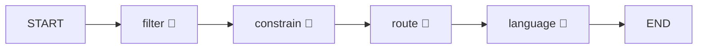

# 06. AI 에이전트 설계 (LangGraph)

## 서비스 구성

- 위치: `sungjiduk/seongjiduk-ai` repo (Python, FastAPI)
- 백엔드 연동: 내부 REST (`RestClient`)
- ai-service 내부 엔드포인트: `POST /ai/trips/generate` · `POST /ai/describe` · `POST /ai/routes/verify`
- 프레임워크: **LangGraph** (상태머신 오케스트레이션)
- 모델/프로바이더: **GPT (OpenAI API)** — `AI_MODEL`(기본 gpt-4o), 프리웜은 상위 모델 오버라이드 가능. langgraph 미설치 시 **로컬 mock 폴백**(ai 다운돼도 backend 데모 지속).

## 핵심 원칙

- AI는 성지 장소를 임의로 생성하지 않는다.
- 백엔드 DB에서 조회한 후보 스팟 목록 안에서만 일정을 구성한다.
- MVP에서는 실제 지도/교통 API를 사용하지 않고 mock 좌표와 추천 체류 시간을 기반으로 루트를 만든다.
- 비용/예산은 MVP에서 정확한 금액 계산이 아니라 `LOW`, `NORMAL`, `HIGH` 태그 수준으로 처리한다.

## 입력

```json
{
  "content": {
    "id": 1,
    "title": "러브라이브! 뮤즈"
  },
  "conditions": {
    "durationDays": 3,
    "budgetLevel": "NORMAL",
    "startLocation": "Tokyo Station",
    "travelStyle": "PILGRIMAGE_ONLY"
  },
  "candidateSpots": [
    {
      "id": 1,
      "name": "쇼헤이바시",
      "city": "Tokyo",
      "lat": 35.0,
      "lng": 139.0,
      "recommendedDurationMin": 30,
      "referenceUrl": "https://example.com/reference"
    }
  ],
  "selectedSpotIds": [1],
  "excludedSpotIds": []
}
```

## 출력

```json
{
  "title": "러브라이브! 뮤즈 2박 3일 성지순례",
  "days": [
    {
      "dayNo": 1,
      "summary": "아키하바라 주변 성지 중심 일정",
      "stops": [
        {
          "spotId": 1,
          "spotType": "PILGRIMAGE",
          "sequence": 1,
          "arrivalTime": "10:00",
          "stayMinutes": 30,
          "reason": "작품 주요 장면과 연결된 대표 성지입니다."
        }
      ]
    }
  ],
  "shareText": "러브라이브! 뮤즈 성지순례 2박 3일 추천 루트"
}
```

## 그래프 설계 (실제 구현 — 3개 LangGraph)

설계 원칙 **"LLM은 판단·언어, 도구는 계산"**을 노드 단위로 구현한다. 🧠=GPT 노드(취향·언어 판단), 🔧=결정론 도구 노드(좌표·시간·집계 계산). GPT에 최적화 수학을 맡기면 환각(거짓 거리)이 나므로 계산은 전부 도구가 한다.

세 그래프는 각 파일에서 `StateGraph`로 조립·`compile()`되며, langgraph 미설치 시 mock 폴백한다.

### ① 일정 생성/재조정 — `trip_graph.py` (`POST /ai/trips/generate`)



| 노드 | 종류 | 역할 |
|------|------|------|
| `filter` | 🔧 | 제외 스팟 제거, 선택 스팟 우선 정렬 |
| `constrain` | 🧠 | 자연어 instruction("2일차 여유롭게, 돈카츠 빼줘") → 구조화 제약(excludeNames·relaxedDays·stopsPerDayCap) 번역. instruction 없으면 no-op |
| `route` | 🔧 | 좌표 이웃우선(NN) 체인 / **블로그 검증 코스 백본** / 거리 기반 이동시간(도보·대중교통 근사) / 점심 슬롯·19시 이월 — 전부 결정론 |
| `language` | 🧠 | 제목·Day 요약·방문 이유·공유 문구 생성 (mock 시 규칙 기반) |

→ 재조정(regenerate)도 같은 그래프. `constrain` 노드가 대화형 재조정의 핵심.

### ② 블로그 동선 검증 — `route_graph.py` (`POST /ai/routes/verify`)


| 노드 | 종류 | 역할 |
|------|------|------|
| `extract` | 🧠 | 블로그 포스트 → 방문 순서 시퀀스 추출 + **실방문 후기 게이트(visited)** (뉴스·감상평 차단) + 언급 스팟 |
| `aggregate` | 🔧 | 스팟 언급수(출처 인덱스 포함)·방향무시 연속쌍 집계 |
| `cluster` | 🔧 | 시퀀스 Jaccard≥0.34 그리디 병합 → 대표 코스(지지수→최신순 상위 3) |

→ "여러 블로거가 독립적으로 같은 순서로 갔다 = 검증된 동선". LLM은 텍스트→순서 번역만.

### ③ 성지 설명·미션 생성 — `describe_graph.py` (`POST /ai/describe`)


- 🧠 단일 노드: 성지 → 한국어명·장면 설명·특별한 점·추천 체류분·여행자 팁·**스팟 미션 1~3개**(FIND/PHOTO/TASTE/EXPERIENCE) 생성. 데이터(Anitabi 장면) + GPT → XR 캐릭터 가이드/미션의 씨앗.

## 상태(State) 정의 (예: trip)

```python
class TripState(TypedDict):
    content: dict
    conditions: TripConditions
    candidateSpots: list[Spot]
    selectedSpotIds: list[int]
    excludedSpotIds: list[int]
    verifiedCourses: list       # 블로그 검증 코스(백본)
    instruction: Optional[str]  # 자연어 재조정
    constraints: Optional[dict] # constrain 노드 산출
    available: list[Spot]       # filter 산출
    skeleton: list[dict]        # route 산출
    title: str; days: list; shareText: str   # language 산출
```

## 실패 처리

| 상황 | 처리 |
|------|------|
| 후보 스팟 부족 | 가능한 범위의 짧은 일정 생성 후 부족 사유 반환 |
| 선택 스팟이 기간 대비 과다 | 우선순위 높은 스팟부터 배치하고 제외 후보 안내 |
| AI 응답 파싱 실패 | 스키마 검증 실패 로그 저장 후 기본 규칙 기반 루트 반환 |
| 모델 호출 실패 | 사용자에게 재시도 안내, 백엔드에 실패 로그 저장 |

## 데이터/벡터스토어

- 성지 데이터는 MySQL의 구조화 데이터로 관리(Anitabi 임포트로 부트스트랩).
- **블로그 검증은 RAG가 아니라 시퀀스 합의**로 처리(순서 유사도가 정답 — 임베딩 kNN보다 정확). 벡터스토어는 향후 ① 스팟별 블로그 팁 RAG(설명 강화) ② 유사 성지 분포 작품 추천(콜드스타트)에 검토.
- 실이동시간은 블로그가 아니라 지도 API가 정답 — 현재는 일본 대중교통 API 미제공으로 거리 기반 결정론 모델 근사.

## 데이터 진화 3단 (신뢰도 레이어)

```
Anitabi(좌표 부트스트랩) → 블로그 합의(순서·신뢰도, route_graph) → VisitRecord(자체 실측, 최종 해자)
```
- 블로그 합의의 정규화 앵커 = 우리 `PilgrimageSpot` DB("칸다묘진"="神田明神"=spot#5). Anitabi 데이터가 있어야만 가능한 고유 강점.
