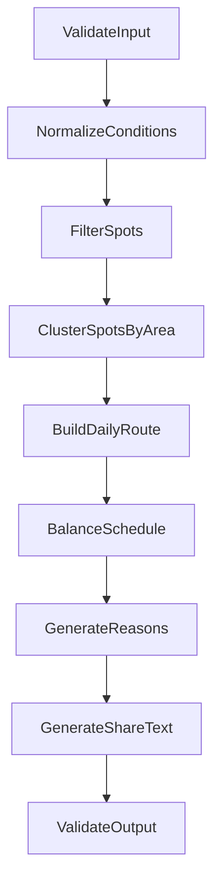
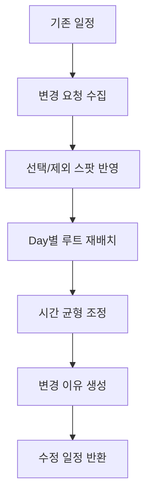

# 06. AI 에이전트 설계 (LangGraph)

## 서비스 구성

- 위치: `sungjiduk/seongjiduk-ai` repo (Python)
- 백엔드 연동: 내부 REST
- 백엔드 호출 예시: `POST /api/trips/generate`
- ai-service 내부 엔드포인트 예시: `POST /ai/trips/generate`
- 모델/프로바이더: 미정

## 핵심 원칙

- AI는 성지 장소를 임의로 생성하지 않는다.
- 백엔드 DB에서 조회한 후보 스팟 목록 안에서만 일정을 구성한다.
- MVP에서는 실제 지도/교통 API를 사용하지 않고 mock 좌표와 추천 체류 시간을 기반으로 루트를 만든다.
- 비용/예산은 MVP에서 정확한 금액 계산이 아니라 `LOW`, `NORMAL`, `HIGH` 태그 수준으로 처리한다.

## 입력

```json
{
  "content": {
    "id": 1,
    "title": "러브라이브! 뮤즈"
  },
  "conditions": {
    "durationDays": 3,
    "budgetLevel": "NORMAL",
    "startLocation": "Tokyo Station",
    "travelStyle": "PILGRIMAGE_ONLY"
  },
  "candidateSpots": [
    {
      "id": 1,
      "name": "쇼헤이바시",
      "city": "Tokyo",
      "lat": 35.0,
      "lng": 139.0,
      "recommendedDurationMin": 30,
      "referenceUrl": "https://example.com/reference"
    }
  ],
  "selectedSpotIds": [1],
  "excludedSpotIds": []
}
```

## 출력

```json
{
  "title": "러브라이브! 뮤즈 2박 3일 성지순례",
  "days": [
    {
      "dayNo": 1,
      "summary": "아키하바라 주변 성지 중심 일정",
      "stops": [
        {
          "spotId": 1,
          "spotType": "PILGRIMAGE",
          "sequence": 1,
          "arrivalTime": "10:00",
          "stayMinutes": 30,
          "reason": "작품 주요 장면과 연결된 대표 성지입니다."
        }
      ]
    }
  ],
  "shareText": "러브라이브! 뮤즈 성지순례 2박 3일 추천 루트"
}
```

## 그래프 설계

### 목적

사용자의 최소 입력값과 성지 후보 데이터를 바탕으로 Day별 성지순례 루트를 생성하고, 사용자의 추가/제외 요청을 반영해 일정을 재조정한다.

### 노드

| 노드 | 역할 |
|------|------|
| ValidateInput | 작품, 기간, 예산, 출발지, 후보 스팟 유효성 검사 |
| NormalizeConditions | 사용자 조건을 내부 enum/태그로 정규화 |
| FilterSpots | 제외 스팟 제거, 선택 스팟 우선 반영 |
| ClusterSpotsByArea | mock 좌표/도시 기준으로 가까운 스팟 묶기 |
| BuildDailyRoute | 여행 일수에 맞춰 Day별 방문 순서 생성 |
| BalanceSchedule | 하루 방문 수와 체류 시간을 조정 |
| GenerateReasons | 장소별 추천 이유 생성 |
| GenerateShareText | 공유용 요약 문구 생성 |
| ValidateOutput | 출력 스키마, 중복 스팟, 누락 필드 검증 |

## 상태(State) 정의

```python
class TripPlannerState(TypedDict):
    content: dict
    conditions: dict
    candidate_spots: list[dict]
    selected_spot_ids: list[int]
    excluded_spot_ids: list[int]
    filtered_spots: list[dict]
    daily_routes: list[dict]
    errors: list[str]
    share_text: str
```

## 그래프 다이어그램 (Mermaid)



## 일정 재조정 흐름

사용자가 지도에서 추가로 가고 싶은 스팟을 선택하거나 특정 스팟을 제외하면 기존 `TripPlan`과 변경 요청을 함께 전달한다.



## 실패 처리

| 상황 | 처리 |
|------|------|
| 후보 스팟 부족 | 가능한 범위의 짧은 일정 생성 후 부족 사유 반환 |
| 선택 스팟이 기간 대비 과다 | 우선순위 높은 스팟부터 배치하고 제외 후보 안내 |
| AI 응답 파싱 실패 | 스키마 검증 실패 로그 저장 후 기본 규칙 기반 루트 반환 |
| 모델 호출 실패 | 사용자에게 재시도 안내, 백엔드에 실패 로그 저장 |

## 데이터/벡터스토어

- MVP RAG 필요 여부: 필수 아님
- 성지 데이터는 PostgreSQL의 구조화 데이터로 관리
- 추후 블로그/문서 기반 자동 수집 또는 RAG가 필요하면 PostgreSQL + pgvector 검토
