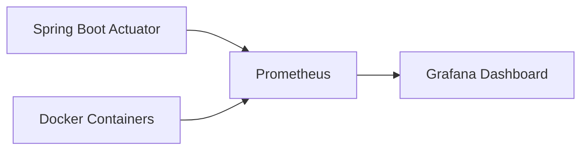

# 07. 관리자 / 통계 설계

## 권한

- ADMIN 롤만 접근 가능
- Spring Security에서 `/api/admin/**` 경로를 ADMIN 전용으로 제한
- MVP에서는 별도 관리자 가입 화면 없이 seed admin 계정을 사용

## 관리자 대시보드 목표

관리자는 서비스가 실제로 사용되고 있는지, 어떤 작품/성지/조건이 많이 선택되는지, AI 플래너가 얼마나 호출되는지 확인할 수 있어야 한다.

## 접속자 통계

| 지표 | 설명 | 기준 |
|------|------|------|
| 오늘 방문 수 | 오늘 발생한 방문 이벤트 수 | UsageEvent |
| 회원가입 수 | 일자별 신규 회원 수 | User |
| 로그인 수 | 일자별 로그인 이벤트 수 | UsageEvent |
| 외원 이용 수 | 일정 생성 요청 중 회원 요청 수 | TripPlan
| 비회원 이용 수 | 일정 생성 요청 중 비회원 요청 수 | TripPlan

## 서비스 이용 통계

| 지표 | 설명 | 기준 |
|------|------|------|
| 총 일정 생성 수 | AI 플래너로 생성된 일정 수 | TripPlan |
| 오늘 일정 생성 수 | 하루 일정 생성 추이 | TripPlan |
| 오늘 AI 생성 호출 수 | 하루 일정 생성 호출 수 | UsageEvent |
| 오늘 AI 재생성 호출 수 | 하루 일정 재생성 호출 수 | UsageEvent |
| 인기 작품 | 일정 생성에 가장 많이 사용된 작품 | TripPlan.content_id |
| 인기 성지 | 일정에 가장 많이 포함된 성지 | TripStop.spot_id |
| 저장 수 | 회원이 저장한 일정 수 | UsageEvent |
| 공유 수 | 공유 링크/공유 문구 생성 수 | UsageEvent |

## 성지 데이터 관리 통계

| 지표 | 설명 |
|------|------|
| 등록 작품 수 | Content 총 개수 |
| 등록 성지 수 | PilgrimageSpot 총 개수 |
| 레퍼런스 링크 수 | SpotReference 총 개수 |
| 미처리 제보 수 | SpotReport status=PENDING |
| 승인된 제보 수 | SpotReport status=APPROVED |

## 수집 이벤트

| 이벤트 타입 | 발생 시점 |
|-------------|-----------|
| PAGE_VIEW | 사용자가 화면에 접속 |
| SIGNUP | 회원가입 성공 |
| LOGIN | 로그인 성공 |
| CONTENT_SELECTED | 작품 선택 |
| SPOT_VIEWED | 성지 상세 조회 |
| TRIP_GENERATED | 일정 생성 |
| TRIP_REGENERATED | 일정 재생성 |
| TRIP_SAVED | 일정 저장 |
| TRIP_SHARED | 일정 공유 |
| VISIT_CREATED | 방문 인증 등록 |
| SPOT_REPORTED | 성지 제보 |

## 수집 방법

- 인증/접속 이벤트: Spring Security 인증 성공 핸들러 또는 인터셉터
- 화면/행동 이벤트: 프론트엔드에서 이벤트 API 호출
- 일정/AI 이벤트: 서비스 로직에서 트랜잭션과 함께 로그 저장
- 화면/행동 이벤트 수집 엔드포인트: `POST /api/events` (EVENT-001, `05_API_명세.md`)
- 관리자 통계 API는 `UsageEvent`, `TripPlan`, `AiRequestLog` 기반으로 집계

### 기록 담당 (파트 분담)

- `AiRequestLog`: **일정 생성/재생성/공유 API(B 파트)** 가 AI 호출 시 트랜잭션과 함께 기록한다. 관리자 통계(C 파트)는 이 테이블을 **읽기 전용**으로 집계만 한다.
- `UsageEvent`: 서버 발생 이벤트(SIGNUP/LOGIN/TRIP_*)는 백엔드가 직접 적재하고, 화면/행동 이벤트(PAGE_VIEW/CONTENT_SELECTED/SPOT_VIEWED)는 프론트가 `POST /api/events`로 전송해 적재한다.

## 관리자 화면 구성

| 영역 | 내용 |
|------|------|
| 요약 카드 | 오늘 방문 수, 총 회원 수, 총 일정 생성 수, AI 호출 수 |
| 그래프 | 일자별 방문 수, 일자별 일정 생성 수 |
| 랭킹 | 인기 작품, 인기 성지, 인기 도시 |
| 분포 | 예산 태그 분포, 여행 기간 분포 |
| 관리 테이블 | 작품/성지 목록, 미처리 성지 제보 |

## 모니터링 제출물

- Grafana 우선 검토
- Prometheus + Spring Actuator + Grafana 구성 추천
- MVP에서는 애플리케이션 메트릭과 컨테이너 상태를 확인할 수 있는 대시보드를 목표로 한다.

## 메트릭 파이프라인

