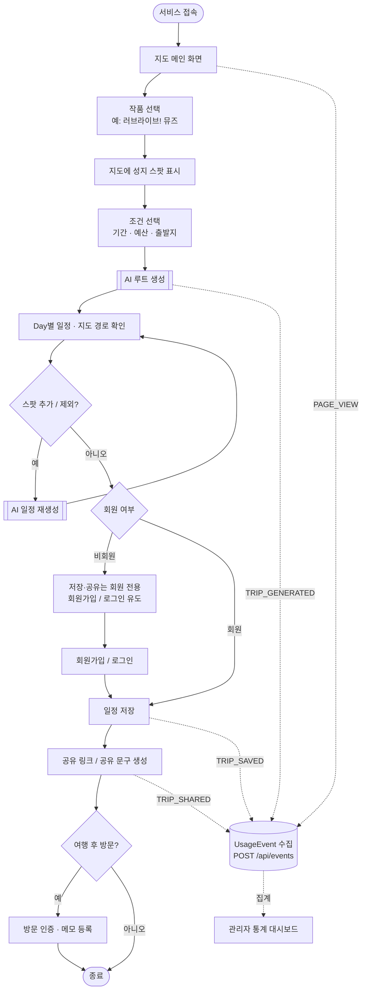

# 12. 서비스 플로우차트

성지덕 사용자 여정 전체 흐름. 진입부터 AI 루트 생성·재생성, 비회원/회원 분기, 저장·공유·방문 인증, 그리고 통계 이벤트 수집까지를 한 장에 나타낸다.

- 관련 문서: `02_최종_기획서.md`(시나리오), `05_API_명세.md`, `07_관리자_통계_설계.md`
- 표기: **실선** = 사용자 여정, **점선** = 백그라운드 이벤트 수집 → 관리자 통계

## 흐름 요약

1. 비회원도 `작품 선택 → 조건 입력 → AI 루트 생성/재생성`까지 자유롭게 사용한다.
2. **저장·공유·방문 기록은 회원 전용**이며, 비회원이 시도하면 회원가입/로그인으로 유도한다.
3. 사용자 행동은 `POST /api/events`로 `UsageEvent`에 적재되어 관리자 통계의 원천이 된다.
4. AI 루트 생성/재생성 호출은 `AiRequestLog`로 별도 기록된다(→ `07_관리자_통계_설계.md`).
