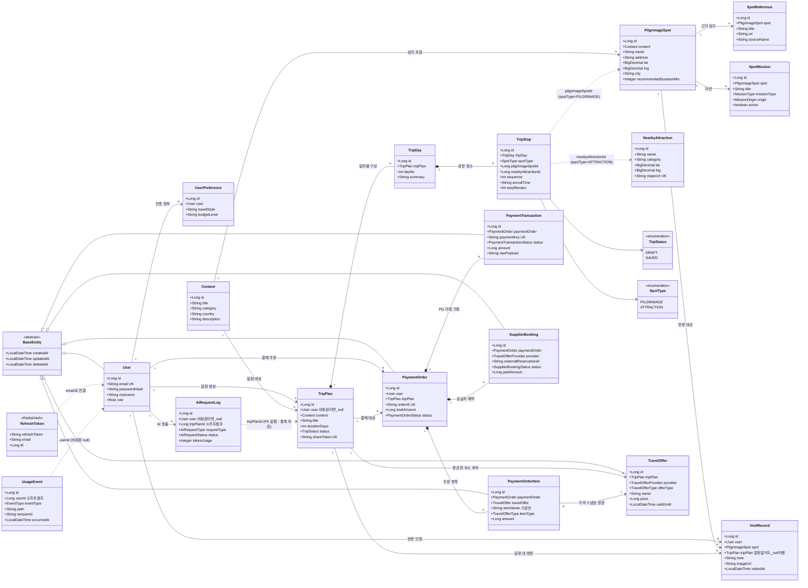
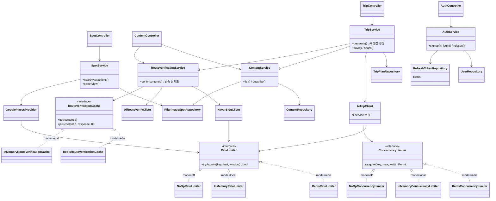

# 13. 클래스 다이어그램

> 제출물: Class Diagram. 실제 코드(`repositories/seongjiduk-backend`, dev 기준 워킹트리)의 `@Entity`를 그대로 읽어 작성했다 — 04 ERD가 "계획"이라면 이 문서는 "구현 실측"이다. Mermaid로 관리하고 PNG는 `../발표자료/assets`로 export한다.

## 1. 엔티티 클래스 다이어그램

JPA 엔티티 18개 + Redis 해시 1개(RefreshToken). 도메인별로 사용자 / 콘텐츠·성지 / 여행 / 결제·예약 / 기록·로그 5개 그룹으로 나눴다.

설계 포인트:
- **다형 FK 회피**: `TripStop`은 `pilgrimageSpotId`·`nearbyAttractionId` 두 컬럼을 모두 갖고 `spotType` enum으로 어느 쪽을 쓰는지 구분한다(둘 중 하나만 채움 — DB CHECK + 애플리케이션 검증). 하나의 FK 컬럼이 두 테이블을 가리키는 다형 FK를 피한 설계.
- **소프트 참조**: `AiRequestLog.tripPlanId`, `UsageEvent.userId`는 FK 제약 없이 id만 보관 — 일정/회원이 삭제돼도 통계 원천 데이터는 보존된다.
- **비회원 허용**: `TripPlan.user`, `AiRequestLog.user`는 null 허용(비회원 일정 생성) → 로그인 시 `assignOwner()`로 소유권 이관.
- 04 ERD에 있던 `UserFavoriteContent`·`SpotReport`·`BookingLink`는 엔티티로 구현되지 않았다(제보는 관리자 DTO 플로우, 예약 링크는 결제 도메인 `TravelOffer`로 대체).

## 2. 서비스 레이어 아키텍처

주요 4개 도메인(Trip / Spot·RouteVerification / Content / Auth)의 Controller → Service → Repository·Infra 흐름과, §7 가드 인터페이스의 **mode 토글 패턴**(설정값 하나로 Redis/InMemory/NoOp 구현체 교체 — `RateLimitConfig`, `RouteCacheConfig`가 조립)을 보여준다.

### 설계 메모

| 항목 | 내용 |
|------|------|
| 계층 규칙 | Controller는 Service만 호출, Service가 Repository·Infra(외부 API 클라이언트)를 조합 |
| §7 가드 | 외부 API(OpenAI·Google·Naver) 호출 직전 `RateLimiter`(고정 윈도우), AI 일정 생성 앞단 `ConcurrencyLimiter`(세마포어+대기열) |
| mode 토글 | `RateLimitConfig`·`RouteCacheConfig`가 프로퍼티(mode) 값으로 Redis(운영·분산) / InMemory(로컬 단일 인스턴스) / NoOp(끔) 구현체를 골라 주입 — 코드 수정 없이 환경별 전환 |
| Redis 사용처 | RefreshToken 저장(TTL 자동 만료), 분산 레이트리밋/세마포어, 검증 결과 캐시(장애 시 fail-open) |
